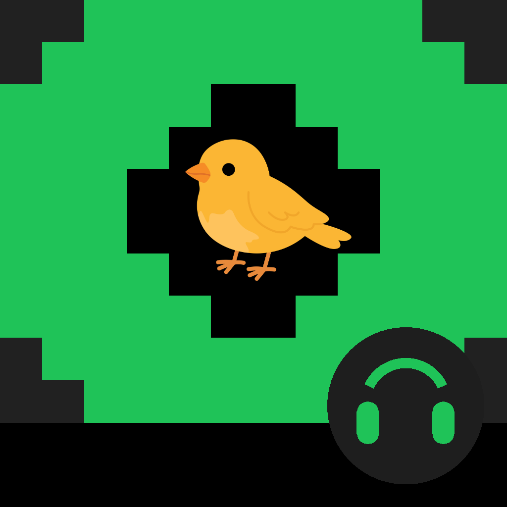

<p align="center">
  
</p>

<h1 align="center">YTMusix Canary</h1>

<p align="center">
  <b>YouTube Music Streamer for Android</b><br/>
  Stream audio from public YouTube playlists, videos, and mixes — no backend, no ads.
</p>

<p align="center">
  
  
  
  
</p>

<p align="center">
  <a href="https://github.com/niiabe/ytmusix/releases/download/v1.5.3/YTMusix-Canary-v1.5.3.apk">
    
  </a>
</p>

---

YTMusix Canary is the **Android-only** canary build of [YTMusix](https://github.com/niiabe/ytmusix), a
Flutter music player that pulls audio from public YouTube content. It is built around an offline-first
design: tracks you play are cached to your device, and play straight from local storage the next time.

## 📲 Download

Get the latest canary build (debug-signed, sideload-only):

- **APK (v1.5.3):** [YTMusix-Canary-v1.5.3.apk](https://github.com/niiabe/ytmusix/releases/download/v1.5.3/YTMusix-Canary-v1.5.3.apk)

> To install, enable **Install unknown apps** for your file manager / browser, then open the APK.
> You can also update in-app from **Settings → About**, or via the startup prompt when a new release drops.

## ✨ Highlights

- 🎧 **Auto-download on play** — every track you play is saved in the background for offline listening
  (live streams are skipped automatically).
- 📥 **Playlists download themselves** — start a playlist and the whole thing downloads in the background.
- 🟢 **Offline library** — your downloaded music lives under the **Offline** section, one tap away from Browse.
- 🎬 **Audio / Video switch** — flip the player to watch the music video with seamless handoff from audio.
- 🔊 **High-quality audio** — defaults to **High** quality, with an in-player quality selector and a quality badge.
- 🇬🇭 **Charts** — Apple Music Ghana Hot 100 + Hot Albums, and a **YouTube Music Top 100 Ghana** shelf.

## 📑 Table of Contents

- [Features](#features)
- [Tech Stack](#tech-stack)
- [Prerequisites](#prerequisites)
- [Setup](#setup)
- [Project Structure](#project-structure)
- [Testing](#testing)
- [Known Issues](#known-issues)
- [Roadmap](#roadmap)
- [License](#license)

## 🎵 Features

### Playback
- **Offline-first** — plays from local files when downloaded, streams only when unavailable.
- **Faster stream startup** — resolves playback redirects once and shows the track immediately while audio loads.
- **Smooth seek & buffer UI** — optimistic seeking plus buffered progress in the full player and mini player.
- **Queue management** — play, pause, skip, previous, shuffle, repeat, auto-advance on track completion.
- **Autoplay** — when the queue ends, seamlessly fetches related YouTube tracks and keeps playing.
- **Sleep timer** — 15m / 30m / 60m / custom timer to auto-stop playback.
- **Lockscreen & notification controls** — Android media notification with play/pause/skip buttons.

### Import & Search
- **YouTube search** — search YouTube directly and play results instantly.
- **Silent search cache** — normalized query cache (in-memory + 7-day `SharedPreferences`) before hitting the network.
- **Smart URL import** — paste a video, playlist, shorts, or music link; detected via a switch-based parser.
- **Instant video playback** — single video and shorts links play audio immediately.
- **Auto-save to library** — searched and played tracks are saved to your home screen as single-track playlists.

### Downloads & Offline
- **Auto-download on play** — the track you're playing is saved in the background at the quality you're hearing.
- **Playlist download** — the full playlist downloads in the background when you start playing it.
- **Per-track download** — download individual tracks straight from the playlist list.
- **Download status** — green when fully downloaded, orange while downloading, spinner for in-progress tracks.
- **Offline section** — the Browse header "Offline" pill opens a bottom sheet of all cached tracks.
- **Cache management** — view total cache size, clear per-playlist or all downloads.

### Charts
- **Apple Music Ghana Hot 100** & **Hot Albums** — official Apple RSS charts.
- **YouTube Music Top 100 Ghana** — trending Ghana music sourced from YouTube search.

### Playlist Management
- **Sort playlists** — by title, date added, or track count.
- **Import / Export** — backup and restore your library as JSON, XML, or Markdown.
- **Swipe to delete / Reorder / Rename** — full playlist editing.
- **Favorites** — star/unstar tracks anywhere; dedicated Favorites shelf on the home screen.

### UI
- **Modern Browse home** — large-title browse screen, category tabs, horizontal artwork, ranked top hits.
- **Exclusive category tabs** — `Added`, `New`, `Trend`, `Podcasts`, `Favourites` keep their own datasets.
- **Expanded player** — full-screen now-playing with large artwork, gradient background, waveform seek, and an
  **audio / video switch** plus a quality selector and quality badge.
- **A/V switcher** — "Copy YouTube link" exposes the video URL while audio plays in-app; the video switch plays it inline.
- **Dark theme** — music-app-inspired dark UI with the bird/mascot launcher icon and green brand accent.

## 🛠 Tech Stack

| Layer | Technology |
|-------|-----------|
| Framework | Flutter (Dart) |
| Architecture | Hexagonal (domain / data / presentation) |
| State | Provider |
| YouTube API | `youtube_explode_dart` 3.1.0 (patched client version) |
| Audio playback | `just_audio` 0.9.46 |
| Video playback | `video_player` 2.11.1 |
| Lockscreen / notification | `audio_service` 0.18.18 |
| Storage | sqflite (SQLite) |
| Secure storage | flutter_secure_storage |
| Downloads | path_provider + http |
| Auth | WebView cookie extraction |
| Platforms | Android |

## ✅ Prerequisites

- Flutter SDK `^3.12.0`
- Android device / emulator

## 🚀 Setup

```bash
git clone https://github.com/niiabe/ytmusix.git
cd ytmusix
flutter pub get
```

### Pub Cache Patch (`youtube_explode_dart`)

The `youtube_explode_dart` package needs a small patch so the browse API returns non-empty results:

**File:** `$PUB_CACHE/hosted/pub.dev/youtube_explode_dart-3.1.0/lib/src/reverse_engineering/youtube_http_client.dart`

Change the InnerTube client context to:

```dart
'clientName': "WEB",
'clientVersion': "2.20250601.00.00",
```

> **Note:** This patch is overwritten on `flutter pub upgrade` and must be re-applied.

### Run (Debug)

```bash
flutter run
```

### Android build

```bash
flutter run -d <android-device-id>      # debug on a device/emulator
flutter build apk --release             # release APK
```

Output: `build/app/outputs/flutter-apk/app-release.apk` (~60 MB)

## 📂 Project Structure

```
lib/
├── app.dart                        # App entry point + theme
├── main.dart                       # DI + AudioService.init
├── core/
│   ├── constants/                  # app_constants, audio_quality, playlist_sort_mode, repeat_mode
│   ├── theme/app_theme.dart        # Dark music-app theme
│   └── utils/                      # format_duration, network_utils, youtube_link_parser
├── domain/
│   ├── entities/                   # playlist, video (Track), chart_item, search_result_models
│   └── repositories/               # audio_repository, playlist_repository
├── data/
│   ├── datasources/
│   │   ├── remote/youtube_remote_datasource.dart
│   │   └── local/playlist_database.dart   # SQLite
│   ├── models/                     # playlist_model, video_model
│   └── repositories/               # audio_repository_impl, playlist_repository_impl
├── presentation/
│   ├── screens/                    # home, player, playlist, search, settings, about, …
│   ├── providers/                  # player, playlist, download, settings, chart
│   └── widgets/                    # player_bar, video_tile, playlist_card, track_action_sheet, brand_logo, …
└── service/                        # audio_handler, auth_service, chart_service, download_service, lyrics_service
```

Android build identity: **`com.ytmusix.ytmusix.canary`** (YTMusix Canary). The source icon
[`tool/icon.png`](tool/icon.png) is fed to `flutter_launcher_icons` and `flutter_native_splash` to
regenerate all `mipmap-*` launcher icons and `drawable-*` splash screens.

## 🧪 Testing

```bash
flutter test
```

`flutter analyze` is clean. Tests cover `chart_service`, `player_provider`, `playlist_provider`, and the
YouTube link parser.

## ⚠️ Known Issues

- **Pub cache patch** — overwritten on `flutter pub upgrade`; re-apply manually.
- **Android Kotlin Gradle Plugin notice** — a future-warning, not a current build blocker.
- **Samsung GPU `BufferQueue` timeout** — harmless Adreno driver spam on Exynos devices; no impact on playback.

## 🗺 Roadmap

See [`futureroadmap.txt`](futureroadmap.txt) for planned features.

## 📄 License

Personal / educational use.
